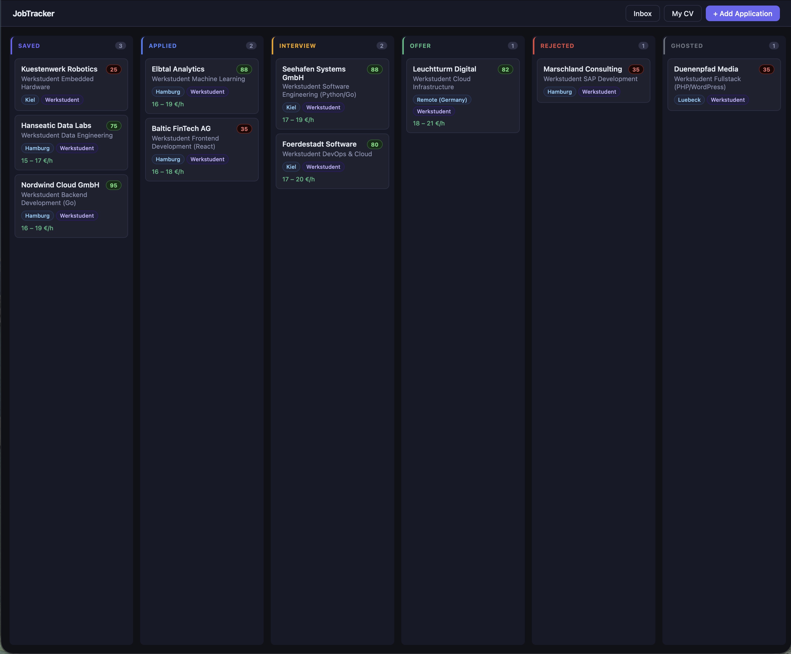
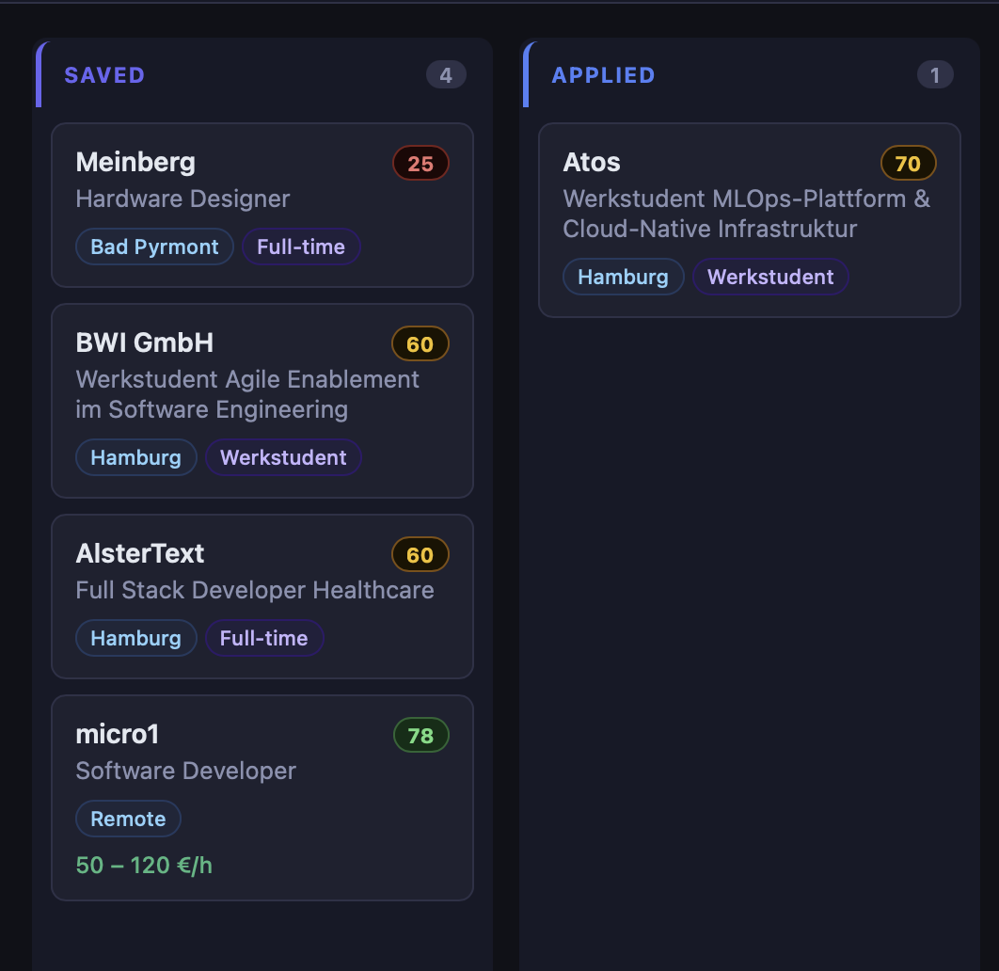
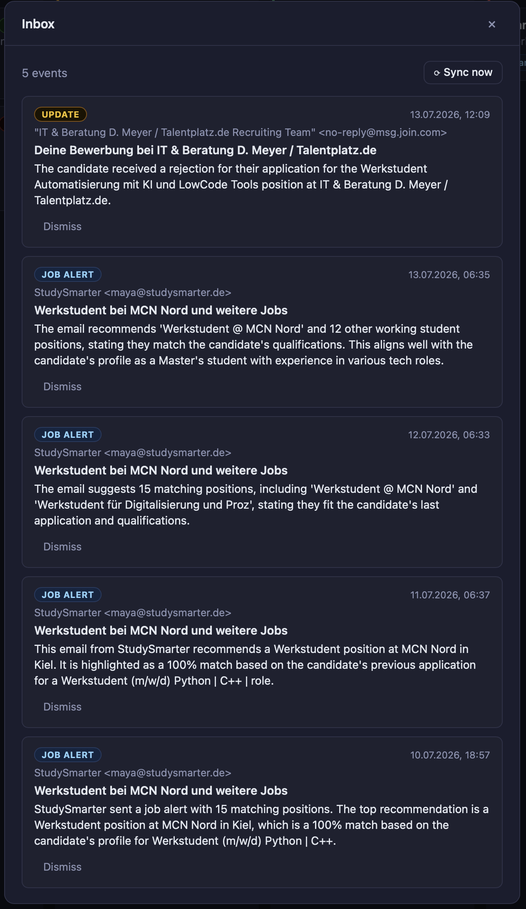
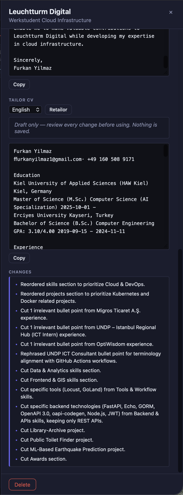

# jobtracker

Self-hosted, AI-assisted job application tracker. Paste a job posting (or just its URL), let AI extract the details, score it against your CV, generate a tailored cover letter, and track every application on a kanban board — while a Gmail integration watches your inbox for rejections, interview invites and new job alerts. All running locally, with your own API keys, your data never leaving your machine.

> Built as a real tool for my own Werkstudent search in Germany, and as a learning project for contract-first API design in Go.



## Features

- **Kanban board** — six-stage pipeline (`saved → applied → interview → offer / rejected / ghosted`) with drag & drop status updates
- **AI job parsing** — paste any raw job posting (LinkedIn copy-paste works fine, noise and all) or a link to a public career page; Gemini extracts company, position, city, employment type and salary into a structured draft you review before saving. URL parsing works on server-rendered single-posting pages; login-walled or JS-only pages fall back to copy-paste with a helpful error.
- **CV fit scoring** — store your CV once, score it against any application: 0–100 fit score, matched/missing keywords, concrete suggestions. New applications are auto-scored in the background; score badges appear on the board.
- **Cover letter generation** — tailored drafts per application in English, German (proper Anrede/Grußformel) or Turkish, in three tones. Drafts only — you review and edit.
- **Gmail inbox watch (optional)** — read-only Gmail integration polls every 30 minutes, classifies new mail with AI: job-alert digests are summarized against your CV, and emails about your applications (rejections, interview invitations) show up as suggestions — you confirm every status change, nothing is applied automatically.
- **German job market aware** — Werkstudent as a first-class employment type, hourly/monthly/yearly salary periods, EUR formatting
- **Local & private** — SQLite file on your disk, bring your own free Gemini API key, read-only Gmail scope, no accounts, no cloud. Email bodies are never stored — only sender, subject and an AI summary.

### Screenshots

**Fit-score badges on the board** — the scorer differentiates: a remote software role scores 78 (green), a hardware role 25 (red):



**Inbox** — AI-classified email events with suggested status changes, applied only on explicit confirmation:



**CV tailoring with an audit log** — every modification is listed for human review; the change log caught the model adding a skill on its very first real test, which is exactly why it exists:



## Architecture

```
React (Vite) ──> Go REST API (Echo) ──> SQLite (GORM)
                      │
                      ├──> Gemini API (structured output: parse, score, classify)
                      └──> Gmail API (read-only, optional, 30-min poll)
```

The OpenAPI spec (`api/openapi.yaml`) is the source of truth: server interfaces, request/response models and routing are generated with [oapi-codegen](https://github.com/oapi-codegen/oapi-codegen). Handlers implement the generated `ServerInterface`; the DB model is deliberately kept separate from API types. AI results follow one principle throughout: **the model suggests, the human confirms** — parsed postings are drafts, scores never overwrite user data, inbox suggestions require an explicit click.

**Stack:** Go 1.25, Echo v4, oapi-codegen v2, GORM + pure-Go SQLite, Google Gemini (structured JSON output), Gmail API (readonly), Vite + React.

## Getting started

Requirements: Go 1.24+, Node 20+, a free Gemini API key from [Google AI Studio](https://aistudio.google.com/app/apikey).

```bash
git clone https://github.com/coderfeye13/jobtracker.git
cd jobtracker

# configure
cp .env.example .env        # then put your Gemini key into .env

# terminal 1 — backend
go run ./cmd/server         # http://localhost:8080

# terminal 2 — frontend
cd web && npm install && npm run dev   # http://localhost:5173
```

`.env`:

```
GEMINI_API_KEY=your_key_here
GEMINI_MODEL=               # optional, defaults to gemini-2.5-flash
GMAIL_QUERY=                # optional, defaults to "newer_than:3d category:(primary OR updates)"
```

The SQLite database (`jobtracker.db`) is created automatically on first run and is gitignored — your application data stays local.

### Optional: Gmail integration

Without it everything else works; `/inbox` features simply return 503.

1. In [Google Cloud Console](https://console.cloud.google.com), enable the **Gmail API** for a project.
2. Configure the OAuth consent screen: External, Testing mode, add your own Gmail address as a test user.
3. Create an **OAuth client ID** of type **Desktop app** and download the JSON.
4. Save it as `credentials.json` in the repo root (already gitignored, together with `token.json`).
5. Start the server; on first run it prints an auth URL — open it, approve (Testing mode shows an "unverified app" warning: Advanced → continue), and paste the code back into the terminal. A `token.json` is created and reused from then on.

The requested scope is `gmail.readonly` only: the app can never send, delete or label mail.

## API overview

| Method             | Path                                | Description                                                |
| ------------------ | ----------------------------------- | ---------------------------------------------------------- |
| `GET`              | `/api/v1/applications`              | List applications, optional `?status=` filter              |
| `POST`             | `/api/v1/applications`              | Create an application                                      |
| `GET/PATCH/DELETE` | `/api/v1/applications/{id}`         | Read / partial update / delete                             |
| `GET/PUT`          | `/api/v1/profile`                   | Read / store your CV (raw text)                            |
| `POST`             | `/api/v1/ai/parse-job`              | Parse raw posting text into a draft (not persisted)        |
| `POST`             | `/api/v1/ai/parse-url`              | Fetch a public posting URL and parse it                    |
| `POST`             | `/api/v1/ai/score`                  | Score your CV against one application (persists fit_score) |
| `POST`             | `/api/v1/ai/cover-letter`           | Generate a tailored cover letter draft                     |
| `POST`             | `/api/v1/inbox/sync`                | Fetch & classify recent Gmail now                          |
| `GET`              | `/api/v1/inbox/events`              | List classified email events                               |
| `POST`             | `/api/v1/inbox/events/{id}/apply`   | Apply a suggested status change                            |
| `POST`             | `/api/v1/inbox/events/{id}/dismiss` | Hide an event                                              |

Full contract in [`api/openapi.yaml`](api/openapi.yaml). To regenerate server code after editing the spec:

```bash
oapi-codegen -config oapi-codegen.yaml api/openapi.yaml
```

## Roadmap

- [x] Phase 1 — CRUD + AI parsing + kanban UI
- [x] Phase 1.5 — `parse-url`: fetch public job postings server-side
- [x] Phase 2 — CV fit scoring & tailored cover letter generation (+ background auto-scoring)
- [x] Phase 3 — Gmail integration: inbox classification, status suggestions with human confirmation
- [x] Phase 2.5 — CV tailoring: per-application content adaptation (reorder, re-emphasize,
      align terminology with the posting) with a strict no-fabrication policy and a
      visible change log; outputs text, natural tone — never invents skills or experience
- [ ] End goal — PDF generation: render the tailored CV into a proper document template
      (evaluating feasibility; content-first until then)
- [ ] Idea — browser extension: one-click capture from LinkedIn/Indeed/StepStone

## Security notes

This is a single-user, localhost tool by design. The URL-parsing endpoint fetches user-supplied URLs server-side; do not expose the API to the public internet as-is (SSRF surface). Secrets (`.env`, `credentials.json`, `token.json`) and personal data (`jobtracker.db`) are gitignored and must stay out of version control.

## Development notes

This project is developed with AI assistance (Claude) as a deliberate workflow: architecture and API design decisions are made and reviewed by hand, boilerplate is delegated. See [`CLAUDE.md`](CLAUDE.md) for the working conventions.

## License

MIT
