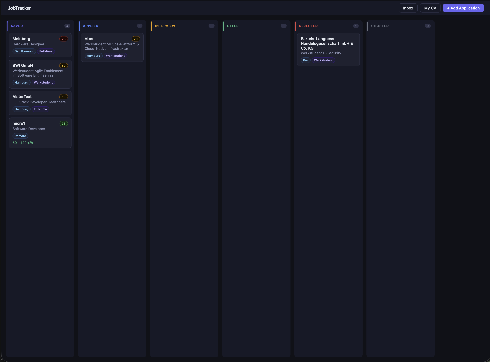

# jobtracker

Self-hosted, AI-assisted job application tracker. Paste a job posting, let AI extract the details, manage every application on a kanban board — all running locally, with your own API key, your data never leaving your machine.

> Built as a real tool for my own Werkstudent search in Germany, and as a learning project for contract-first API design in Go.



## Features

- **Kanban board** — six-stage pipeline (`saved → applied → interview → offer / rejected / ghosted`) with drag & drop status updates
- **AI job parsing** — paste any raw job posting (LinkedIn copy-paste works fine, noise and all); Gemini extracts company, position, city, employment type and salary into a structured draft you review before saving
- **German job market aware** — Werkstudent as a first-class employment type, hourly/monthly/yearly salary periods, EUR formatting
- **Local & private** — SQLite file on your disk, bring your own free Gemini API key, no accounts, no cloud

## Architecture

```
React (Vite) ──> Go REST API (Echo) ──> SQLite (GORM)
                      │
                      └──> Gemini API (structured output)
```

The OpenAPI spec (`api/openapi.yaml`) is the source of truth: server interfaces, request/response models and routing are generated with [oapi-codegen](https://github.com/oapi-codegen/oapi-codegen). Handlers implement the generated `ServerInterface`; the DB model is deliberately kept separate from API types.

**Stack:** Go 1.25, Echo v4, oapi-codegen v2, GORM + pure-Go SQLite, Google Gemini (structured JSON output), Vite + React.

## Getting started

Requirements: Go 1.24+, Node 20+, a free Gemini API key from [Google AI Studio](https://aistudio.google.com/app/apikey).

```bash
git clone https://github.com/coderfeye13/jobtracker.git
cd jobtracker

# configure
cp .env.example .env        # then put your key into .env

# terminal 1 — backend
go run ./cmd/server         # http://localhost:8080

# terminal 2 — frontend
cd web && npm install && npm run dev   # http://localhost:5173
```

`.env`:

```
GEMINI_API_KEY=your_key_here
GEMINI_MODEL=               # optional, defaults to gemini-2.5-flash
```

The SQLite database (`jobtracker.db`) is created automatically on first run and is gitignored — your application data stays local.

## API overview

| Method   | Path                        | Description                                         |
| -------- | --------------------------- | --------------------------------------------------- |
| `GET`    | `/api/v1/applications`      | List applications, optional `?status=` filter       |
| `POST`   | `/api/v1/applications`      | Create an application                               |
| `GET`    | `/api/v1/applications/{id}` | Get one application                                 |
| `PATCH`  | `/api/v1/applications/{id}` | Partial update (e.g. status change)                 |
| `DELETE` | `/api/v1/applications/{id}` | Delete                                              |
| `POST`   | `/api/v1/ai/parse-job`      | Parse raw posting text into a draft (not persisted) |

Full contract in [`api/openapi.yaml`](api/openapi.yaml). To regenerate server code after editing the spec:

```bash
oapi-codegen -config oapi-codegen.yaml api/openapi.yaml
```

## Roadmap

- [x] Phase 1 — CRUD + AI parsing + kanban UI
- [ ] Phase 1.5 — `parse-url`: fetch public job postings (company career pages) server-side
- [ ] Phase 2 — CV fit scoring & tailored cover letter generation
- [ ] Phase 3 — Gmail integration: scan job alert mails, auto-track rejections/interview invites
- [ ] Idea — browser extension: one-click capture from LinkedIn/Indeed/StepStone

## Development notes

This project is developed with AI assistance (Claude) as a deliberate workflow: architecture and API design decisions are made and reviewed by hand, boilerplate is delegated. See [`CLAUDE.md`](CLAUDE.md) for the working conventions.

## License

MIT
